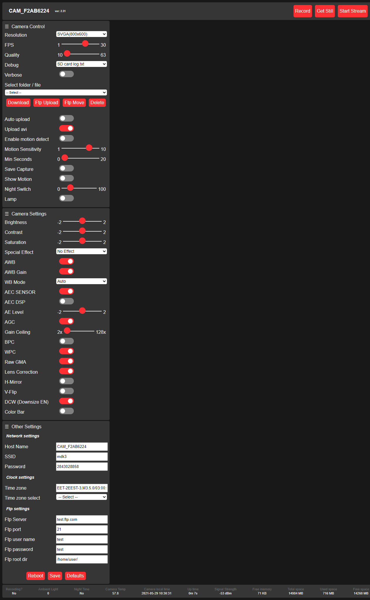

This is a modified version from https://github.com/s60sc/ESP32-CAM_MJPEG2SD

ver 4.1b
* Auto update information bar on the bottom of the page with get requests

ver 4.1a
* Added option to reset log file from the /log page

ver 4.1
* Fixed logging to sdcard issues..Added controls to log page..

ver 4.0
* Merge branch 'master' of https://github.com/s60sc/ESP32-CAM_MJPEG2SD

ver 2.4
* Merge branch 'master' of https://github.com/s60sc/ESP32-CAM_MJPEG2SD

ver 2.31b
* Fix range controls on load config.
* Flush log file when download.

ver 2.31a
* Fix debug mode telnet. Send exit string to telnet to quit on change debug mode.

ver 2.31
* Enable/Disable motion detection by button to save power.
* Record button to force record to sd card even if no motion detection

ver 2.3
* Download button added to download a mjpeg recording from browser.
* Turn on wait cursor when selecting files from sd card to wait for responce and avoid errors.

vet 2.2
* Debug mode select in user interface: 0-Serial, 1-log.txt, 2-telnet
  Added local sdcard logging (/log.txt) or telnet on port 443. Set debug mode by drop list in menu.
  Uncomment //remote_log_init(); on line 53 on file ESP32-CAM_MJPEG2SD to enable wifi connection debugging (remote_log_mode 1 - sdcard file only)
  You can use view-source:http://[camera ip]/file?log.txt to view the log generated.
  You can run `telnet 192.168.4.1 443` on a remote host to debug
* Use internal onChip temperature sensor if no ds18b20 external temperature sensor is present
* Added normal / maximize / maximize_no_strech, button for full screen video playback. 
* Fixed set station static IP from config.
* Fixed remote telnet debug.
* compile with arduino-esp32 stable release is v1.0.6

ver 1.9
* format the sd card if mount failed 
* Remote logging/debugging via telnet on camera ip and port 443.
* Automatic ftp upload new recordings on motion detection.
* Check if file exists on upload a folder and ignore it. Incremental  upload
* Fixed save / restore camera settings on boot
* Reload page on reboot

# ESP32-CAM_MJPEG2SD
ESP32 Camera extension to record JPEGs to SD card as MJPEG files and playback to browser. If a microphone is installed then a WAV file is also created - see  __Audio Recording__ section below.

Files uploaded by FTP or downloaded from browser are optionally converted to AVI format to allow recordings to replay at correct frame rate on media players, including the audio if available.

 This [instructable](https://www.instructables.com/How-to-Make-a-WiFi-Security-Camera-ESP32-CAM-DIY-R/) by [Max Imagination](https://www.instructables.com/member/Max+Imagination/) shows how build a WiFi Security Camera using this code.

## Purpose
The MJPEG format contains the original JPEG images but displays them as a video. MJPEG playback is not inherently rate controlled, but the app attempts to play back at the MJPEG recording rate. MJPEG files can also be played on video apps or converted into rate controlled AVI or MKV files etc.

Saving a set of JPEGs as a single file is faster than as individual files and is easier to manage, particularly for small image sizes. Actual rate depends on quality and size of SD card and complexity and quality of images. A no-name 4GB SDHC labelled as Class 6 was 3 times slower than a genuine Sandisk 4GB SDHC Class 2. The following recording rates were achieved on a freshly formatted Sandisk 4GB SDHC Class 2 using SD_MMC 1 line mode on a AI Thinker OV2640 board, set to maximum JPEG quality and highest clock rate.

Frame Size | OV2640 camera max fps | mjpeg2sd max fps | Detection time ms
------------ | ------------- | ------------- | -------------
96X96 | 50 | 45 |  15
QQVGA | 50 | 45 |  20
QCIF  | 50 | 45 |  30
HQVGA | 50 | 45 |  40
240X240 | 50 | 45 |  55
QVGA | 50 | 40 |  70
CIF | 50 | 40 | 110
HGVA | 50 | 40 | 130
VGA | 25 | 20 |  80
SVGA | 25 | 20 | 120
XGA | 6.25 | 5 | 180
HD | 6.25 | 5 | 220
SXGA | 6.25 | 5 | 300
UXGA | 6.25 | 5 | 450

## Design

The ESP32 Cam module has 4MB of pSRAM which is used to buffer the camera frames and the construction of the MJPEG file to minimise the number of SD file writes, and optimise the writes by aligning them with the SD card sector size. For playback the MJPEG is read from SD into a multiple sector sized buffer, and sent to the browser as timed individual frames.

The SD card can be used in either __MMC 1 line__ mode (default) or __MMC 4 line__ mode. The __MMC 1 line__ mode is practically as fast as __MMC 4 line__ and frees up pin 4 (connected to onboard Lamp), and pin 12 which can be used for eg a PIR.  

The MJPEG files are named using a date time format __YYYYMMDD_HHMMSS__, with added frame size, recording rate, duration and frame count, eg __20200130_201015_VGA_15_60_900.mjpeg__, and stored in a per day folder __YYYYMMDD__.  
The ESP32 time is set from an NTP server. 

## Installation and Use

Note: Updated for `arduino-esp32` Stable Release v2.0.2, compile with Partition Scheme: `Minimal SPIFFS (...)`.  

Download files into the Arduino IDE sketch location, removing `-master` from the folder name.  
The included sketch `ESP32-CAM_MJPEG2SD.ino` was originally derived from the `CameraWebServer.ino` example sketch included in the Arduino ESP32 library. 
Additional code has been added to the original file `app_httpd.cpp` to handle the extra browser options, and an additional file`mjpeg2sd.cpp` contains the SD handling code. Further features have been added in additional files. The web page content in `camera_index.h` has been updated to include additional functions. 
The face detection code has been removed to reduce the sketch size to allow OTA updates.

Select required ESP-CAM board using `CAMERA_MODEL_` in `myConfig.h`.

To set the recording parameters, additional options are provided on the camera index web page, where:
* `Frame Rate` is the required frames per second
* `Min Frames` is the minimum number of frames to be captured or the file is deleted
* `Verbose` if checked outputs additional logging to the serial monitor

An MJPEG recording is generated by holding a given pin high (kept low by internal pulldown when released).  
The pin to use is:
* pin 12 when in 1 line mode
* pin 33 when in 4 line mode

An MJPEG recording can also be generated by the camera itself detecting motion as given in the __Motion detection by Camera__ section below.

In addition a recording can be requested manually using the __Record__ button on the web page.

If recording occurs whilst also live streaming to browser, the frame rate will be slower. 

To play back a recording, select the file using __Select folder / file__ on the browser to select the day folder then the required MJPEG file.
After selecting the MJPEG file, press __Start Stream__ button to playback the recording. 
The recorded playback rate can be changed during replay by changing the __FPS__ value. 
After playback finished, press __Stop Stream__ button. 
If a recording is started during a playback, playback will stop.

The following functions are provided by [@gemi254](https://github.com/gemi254):

* Entire folders or files within folders can be deleted by selecting the required file or folder from the drop down list then pressing the __Delete__ button and confirming.

* Entire folders or files within folders can be uploaded to a remote server via FTP by selecting the required file or folder from the drop down list then pressing the __FTP Upload__ button.

* Download selected MJPEG file from SD card to browser using __Download__ button. Can be downloaded in AVI format.

* The FTP, Wifi, and other parameters can be defined in file `myConfig.h`, but can also be defined via the browser under __Other Settings__ using the ESP in AP mode.

* Check internet connection and automatically reconnect if needed on power loss.

* Added mdns name services in order to use `http://[Host Name]` instead of ip address.

* Delete or ftp upload and delete oldest folder when card free space is running out.  
  See `minCardFreeSpace` and `freeSpaceMode` in `myConfig.h`
  
* Additional log viewing options via web page __Log Mode__ dropdown, in addition to serial port:
  * From SD card, accessed via `http://[camera ip]/log`, or using __Download__ button
  * From remote host using `telnet [camera ip] 443`

Additional ancilliary functions:

* Enable Over The Air (OTA) updates - see `USE_OTA` in `myConfig.h`
* Add temperature sensor - see `USE_DS18B20` in `myConfig.h`

Browser functions only tested on Chrome.

## Motion detection by Camera

An MJPEG recording can also be generated by the camera itself detecting motion using the `motionDetect.cpp` file.  
JPEG images of any size are retrieved from the camera and 1 in N images are sampled on the fly for movement by decoding them to very small grayscale bitmap images which are compared to the previous sample. The small sizes provide smoothing to remove artefacts and reduce processing time.

For movement detection a high sample rate of 1 in 2 is used. When movement has been detected, the rate for checking for movement stop is reduced to 1 in 10 so that the JPEGs can be captured with only a small overhead. The __Detection time ms__ table shows typical time in millis to decode and analyse a frame retrieved from the OV2640 camera.

Motion detection by camera is enabled by default, to disable click off __Enable motion detect__ button on web page.

Additional options are provided on the camera index page, where:
* `Motion Sensitivity` sets a threshold for movement detection, higher is more sensitive.
* `Show Motion` if enabled and the __Start Stream__ button pressed, shows images of how movement is detected for calibration purposes. Gray pixels show movement, which turn to black if the motion threshold is reached.

The `motionDetect.cpp` file contains additional documented monitoring parameters that can be modified. 

## Audio Recording

An I2S microphone can be supported, such as INMP441. PDM and analog microphones cannot be used due to limitations of I2S_NUM_1 peripheral. I2S_NUM_0 is not available as it is used by the camera. The audio is formatted as 16 bit single channel PCM with sample rate of 16kHz. The I2S microphone needs 3 free pins on the ESP32, selected from the following 4 pins (assuming __MMC 1 line__ mode selected):
- pin 3: Labelled U0R. Only use as input pin, i.e for microphone SD pin, as also used for flashing. Default microphone SD pin.
- pin 4: Also used for onboard lamp. Lamp can be disabled by removing its current limiting resistor. Default microphone SCK pin.
- pin 12: Only use as output pin, i.e for microphone WS or SCK pin. Default microphone WS pin.
- pin 33: Used by onboard red LED. Not broken out, but can repurpose the otherwise pointless VCC pin by removing its adjacent resistor marked 3V3 and the red LED current limiting resistor then running a wire between the VCC pin and the red LED resistor solder tab.

The web page has a slider for __Microphone Gain__. The higher the value the higher the gain. Selecting 0 disables the microphone.

Refer to the file `mic.cpp` to define microphone pin assignment and for further info.
