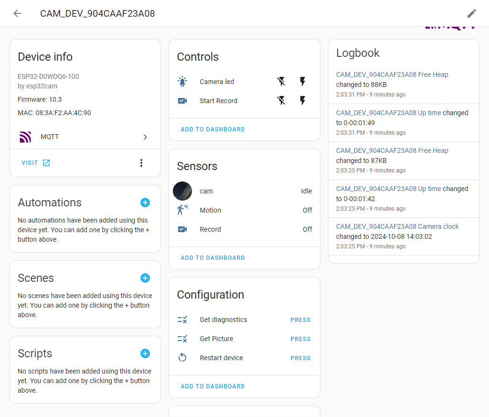
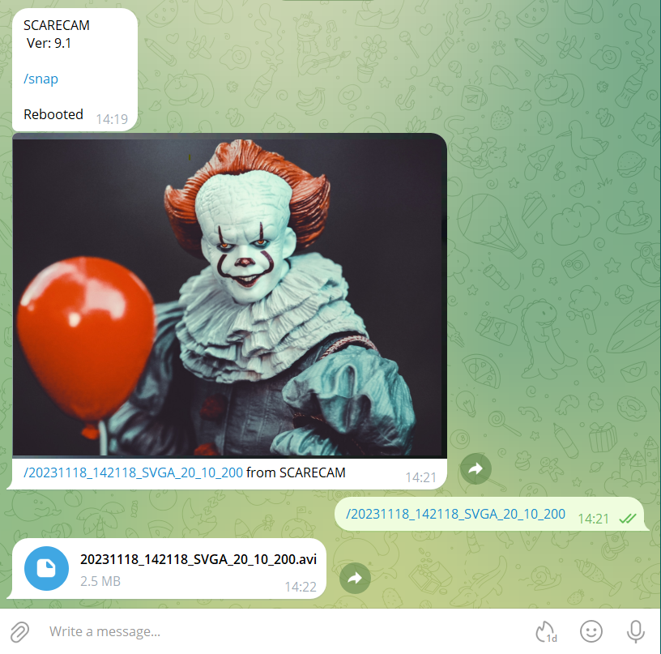
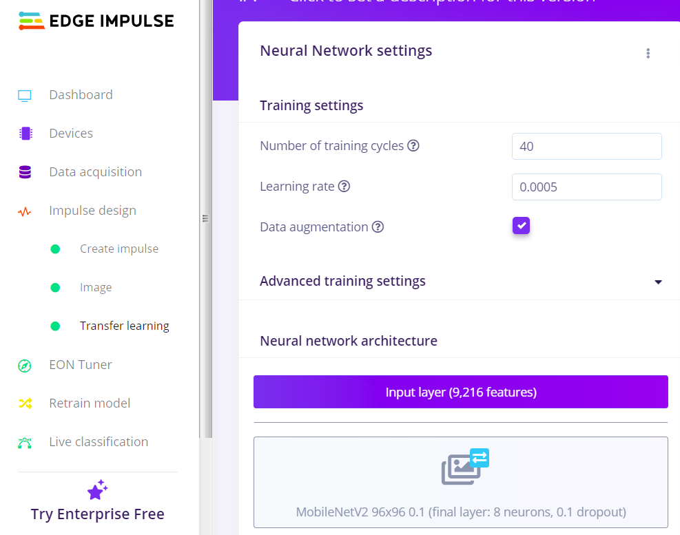
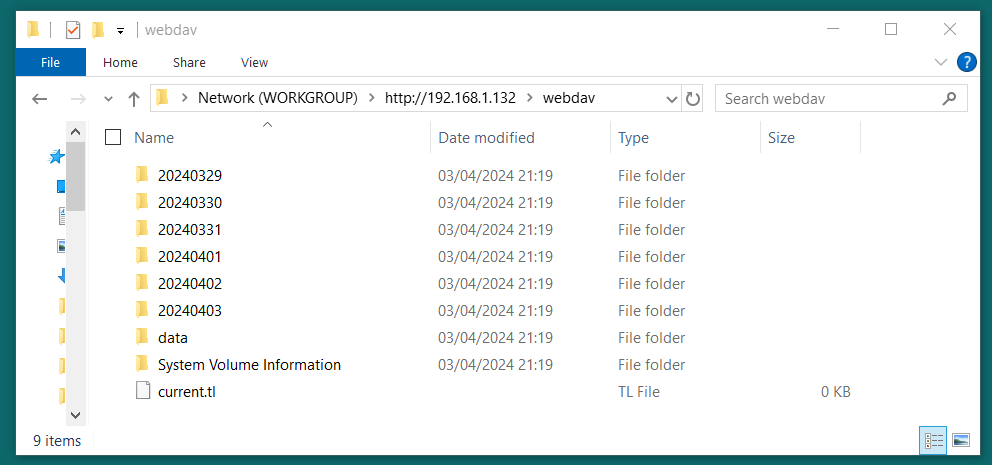

# ESP32-CAM_MJPEG2SD

Application for ESP32 / ESP32S3 with OV2640 / OV5640 camera to record JPEGs to SD card as AVI files and playback to browser as an MJPEG stream. The AVI format allows recordings to replay at correct frame rate on media players. If a microphone is installed then a WAV file is also created and stored in the AVI file.  
The application supports:
* [Motion detection by camera](#motion-detection-by-camera) or PIR / radar sensor
* Time lapse recording
* [Audio Recording](#audio-recording) from I2S or PDM microphones
* Camera pan / tilt servos and lamp control
* [RTSP Server](#rtsp) stream Video, Audio and Subtitles
* [Telemetry Recording](#telemetry-recording) during camera recording.
* [Remote Control](#remote-control) of camera mounted vehicle.
* Alert notification using [Telegram](#telegram-bot) or Email
* Concurrent streaming to web browser and [remote NVR](#stream-to-nvr) using HTTP or RTSP
* Transfer recordings using FTP, HTTPS, [WebDAV](#webdav), or download from browser
* [MQTT](#mqtt) control with Home Assistant integration.
* [External Heartbeat](#external-heartbeat) support.
* Support for peripherals: SG90 servos, MX1508 H-bridge, 28BYJ-48 stepper, HW-504 joystick, BMP280, MPU9250, MY9221 / WS2812 / SK6812 Led
* Support for [I2C devices](#i2c-devices): BMP280, BME280, MPU6050, MPU9350, SSD1306, LCD1602, etc.
* Interface for [Machine Learning](#machine-learning) support.
* [Camera Hub](#camera-hub) feature to access other ESP32-CAM_MJPEG2SD devices.
* [Photogrammetry](#photogrammetry) feature to capture photos for 3D imaging.
* Use of [Auxiliary Board](#auxiliary-board) for additional pins.
* [Intercom](#intercom) feature using mic and speaker on ESP and mic and speaker on user device browser.

The ESP32 cannot support all of the features as it will run out of heap space. For better functionality and performance, use one of the new ESP32S3 camera boards, eg Freenove ESP32S3 Cam, ESP32S3 XIAO Sense, but avoid no-name boards marked `ESPS3 RE:1.0`

***This is a complex app and some users are raising issues when the app reports a warning, but this is the app notifying the user that there is an problem with their setup, which only the user can fix. Be aware that some clone boards have different specs to the original, eg PSRAM size. Please only raise issues for actual bugs (ERR messages, unhandled library error or crash). Thanks.  
To suggest an improvement or enhancement use Discussions.*** 

Changes up to version 10.6:
* Stream to [NVR](#stream-to-nvr) using integration to RTSPServer library contributed by [@rjsachse](https://github.com/rjsachse). 
* Frame resolution selection mismatch corrected due to [#10801](https://github.com/espressif/arduino-esp32/issues/10801) in arduino core v3.1.0
* SD card 4 bit mode configurable (see `utilsFS.cpp`)
* Shared I2C fixed following code changes in Arduino core v3.1.1
* 24Mhz camera clock available for faster frame rate on ESP32S3, contributed by [@josef2600](https://github.com/josef2600).
* RTSP server now has multiple client support as well as user/pass authentication.
* Limited support added for boards with only 2MB PSRAM

## Purpose

The application enables video capture of motion detection or timelapse recording. Examples include security cameras, wildlife monitoring, rocket flight monitoring, FPV vehicle control.  This [instructable](https://www.instructables.com/How-to-Make-a-WiFi-Security-Camera-ESP32-CAM-DIY-R/) by [Max Imagination](https://www.instructables.com/member/Max+Imagination/) shows how to build a WiFi Security Camera using an earlier version of this code, plus a later video on how to [install and use](https://www.youtube.com/watch?v=k_PJLkfqDuI&t=247s) the app.

Saving a set of JPEGs as a single file is faster than as individual files and is easier to manage, particularly for small image sizes. Actual rate depends on quality and size of SD card and complexity and quality of images. A no-name 4GB SDHC labelled as Class 6 was 3 times slower than a genuine Sandisk 4GB SDHC Class 2. The following recording rates were achieved on a freshly formatted Sandisk 4GB SDHC Class 2 on a AI Thinker OV2640 board, set to maximum JPEG quality and clock rate of 20MHz. With a clock rate of 24Mhz on ESP32S3, the maximum frame rates can increase 50->60, 25->30 but it may be necessary to reduce JPEG quality.

Frame Size | OV2640 camera max fps | mjpeg2sd max fps | Detection time ms
------------ | ------------- | ------------- | -------------
96X96 | 50 | 45 |  15
QQVGA | 50 | 45 |  20
QCIF  | 50 | 45 |  30
HQVGA | 50 | 45 |  40
240X240 | 50 | 45 |  55
QVGA | 50 | 40 |  70
CIF | 50 | 40 | 110
HVGA | 50 | 40 | 130
VGA | 25 | 20 |  80
SVGA | 25 | 20 | 120
XGA | 12.5 | 5 | 180
HD | 12.5 | 5 | 220
SXGA | 12.5 | 5 | 300
UXGA | 12.5 | 5 | 450

The ESP32S3 (using Freenove ESP32S3 Cam board hosting ESP32S3 N8R8 module) runs the app about double the speed of the ESP32 mainly due to much faster PSRAM. It can record at the maximum OV2640 frame rates including [audio](#audio-recording) for all frame sizes except UXGA (max 10fps).

## Design

The ESP32 Cam module has 4MB of PSRAM (8MB on most ESP32S3) which is used to buffer the camera frames and the construction of the AVI file to minimise the number of SD file writes, and optimise the writes by aligning them with the SD card sector size. For playback the AVI is read from SD into a multiple sector sized buffer, and sent to the browser as timed individual frames. By dewfault the SD card is used in **MMC 1 line** mode, as this is practically as fast as **MMC 4 line** mode on the ESP32 and frees up pin 4 (connected to onboard Lamp), and pin 12 which can be used for eg a PIR. On the ESP32S3 however, tests by [@josef2600](https://github.com/josef2600) indicate that **MMC 4 line** mode provides a [doubling](https://github.com/s60sc/ESP32-CAM_MJPEG2SD/issues/529#issuecomment-2588088722) of speed.  

The AVI files are named using a date time format **YYYYMMDD_HHMMSS** with added frame size, FPS recording rate, duration in secs, eg **20200130_201015_VGA_15_60.avi**, and stored in a per day folder **YYYYMMDD**. If audio is included the filename ends with **_S**.  If telemetry is available the filename ends with **_M**.  
The ESP32 time is set from an NTP server or connected browser client.

## Installation

Download github files into the Arduino IDE sketch folder, removing `-master` from the application folder name.
Compile with at least arduino-esp32 core v3.1.1 which contains network fixes and frame selection changes.
Select the required ESP-CAM board by uncommenting ONE only of the `#define CAMERA_MODEL_*` in `appGlobals.h` unless using the one of the defaults:
* ESP32 Cam board - `CAMERA_MODEL_AI_THINKER`
* Freenove ESP32S3 Cam board - `CAMERA_MODEL_FREENOVE_ESP32S3_CAM`  

Optional features are not included by default. To include a feature, in `appGlobals.h` set relevant `#define INCLUDE_*` to `true`. 

Select the ESP32 or ESP32S3 Dev Module board and compile with PSRAM enabled and the following Partition scheme:
* ESP32 - `Minimal SPIFFS (...)`
* ESP32S3 - `8M with spiffs (...)` or `16MB(3MB APP...)`

**NOTE:**
* **If you get compilation errors you need to update your `arduino-esp32` core library in the IDE to latest v3.x
using [Boards Manager](https://github.com/s60sc/ESP32-CAM_MJPEG2SD/issues/61#issuecomment-1034928567)**
* **If you get error: `Startup Failure: Check SD card inserted`, or `Camera init error 0x105` it is usually a [camera board selection](https://github.com/s60sc/ESP32-CAM_MJPEG2SD/issues/219#issuecomment-1627785417) issue**
* **If you get warning: `Crash loop detected, check log`, it is usually an inadequate power supply.**

On first installation, the application will start in wifi AP mode - connect to SSID: **ESP-CAM_MJPEG_...**, to allow router to be selected and router password entered via the web page on `192.168.4.1`. The configuration data file (except passwords) is automatically created, and the application web pages automatically downloaded from GitHub to the SD card **/data** folder when an internet connection is available.

Subsequent updates to the application, or to the **/data** folder files, can be made using the **OTA Upload** tab. The **/data** folder can also be reloaded from GitHub using the **Reload /data** button on the **Edit Config** tab, or by using a WebDAV client.

An alternative installation process by [@ldijkman](https://github.com/ldijkman) is described [here](https://youtu.be/YLLGBM3i2aQ).

Browser functions only fully tested on Chrome.

## Main Function

A recording is generated either by the camera itself detecting motion, or by holding a given pin high (kept low by internal pulldown when released), eg by using an active high motion sensor such as PIR or RCWL-0516 microwave radar.
In addition a recording can be requested manually using the **Start Recording** button on the web page.

To play back a recording, select the file using **Playback & File Transfers** sidebar button to select the day folder then the required AVI file.
After selecting the AVI file, press **Start Playback** button to playback the recording. 
The **Start Stream** button shows a live video only feed from the camera. 

Recordings can then be uploaded to an FTP or HTTPS server or downloaded to the browser for playback on a media application, eg VLC.
To incorporate FTP or HTTPS server, set `#define INCLUDE_FTP_HFS` to `true`.

A time lapse feature is also available which can run in parallel with motion capture. Time lapse files have the format **20200130_201015_VGA_15_60_T.avi**

## Other Functions and Configuration

The operation of the application can be modified dynamically as below, by using the main web page, which should mostly be self explanatory.

Connections:
* The FTP / HTTPS, Wifi, SMTP, and time zone parameters can be defined in **Access Settings** sidebar button. 
  - for **Time Zone** use dropdown, or paste in values from second column [here](https://raw.githubusercontent.com/nayarsystems/posix_tz_db/master/zones.csv)
* To make the changes persistent, press the **Save** button
* mdns name services in order to use `http://[Host Name]` instead of ip address.

To change the recording parameters:
* `Resolution` is the pixel size of each frame
* `Frame Rate` is the required frames per second
* `Quality` is the level of JPEG compression which affects image size.

SD storage management:
* Folders or files within folders can be deleted by selecting the required file or folder from the drop down list then pressing the **Delete** button and confirming.
* Folders or files within folders can be uploaded to a remote server via FTP / HTTPS by selecting the required file or folder from the drop down list then pressing the **File Upload** button. Can be uploaded in AVI format.
* Download selected AVI file from SD card to browser using **Download** button.
* Delete, or upload and delete oldest folder when card free space is running out.  

View application log via web page, displayed using **Show Log** tab:
  * Select log type for display:
    * RTC RAM: Cyclic 7KB log saved in RTC RAM (default)
    * Websocket: log is dynamically output via websocket
    * SD card: Unlimited size log saved to SD card
  * Use slider to enable SD logging, but can slow recording rate
  * Use buttons to refresh or clear selected log

## Configuration Web Page

More configuration details accessed via **Edit Config** tab, which displays further buttons:

**Wifi**:
Additional WiFi and webserver settings.

**Motion**: 
See [**Motion detection by Camera**](#motion-detection-by-camera) section.

**Peripherals** eg:
* Select if a PIR or radar sensor is to be used (which can also be used in parallel with camera motion detection).
* Control pan / tilt cradle for camera.
* Connect a PDM or I2S microphone and I2S amplifier.
* Connect a DS18B20 temperature sensor.
* Monitor voltage of battery supply on ADC pin.
* Wakeup on LDR after deep sleep at night.

To incorporate peripherals, set `#define INCLUDE_PERIPH` to `true`.

The **Peripherals** tab also enables further config tabs to be displayed:
* **Audio**: to configure microphones and amplifiers.
* **RC Config**: to configure hardware for remote control vehcles.
* **Servos**: to configure servos for camera control and RC steering
* **PG Control**: to configure and control hardware for photogrammetry.  

After changes are applied, need to press `Save` then `Reboot ESP` to restart peripherals with changes.

Note that there are not enough free pins on the ESP32 camera module to allow all external sensors to be used. Pins that can be used (with some limitations) are: 3, 4, 12, 13, 26, 27 32, 33.
* pin 3: Labelled U0R. Only use as input pin, as also used for flashing. 
* pin 4: Also used for onboard lamp. Lamp can be disabled by removing its current limiting resistor. 
* pin 12: Only use as output pin.
* pin 13: Is weakly pulled high.
* pins 26, 27: I2C pins shareable with camera - see [I2C devices](#i2c-devices)
* pin 32: Controls camera power on / off. Not broken out, but with electronics knowledge can be disconnected leaving camera permanently on by referring to the board schematic.
* pin 33: Used by onboard red LED. Not broken out, but can repurpose the otherwise pointless VCC pin by removing its adjacent resistor marked 3V3, and the red LED current limiting resistor, then running a wire between the VCC pin and the red LED resistor solder tab.

Do not use any other exposed pin including pin 16 used by PSRAM.

The ESP32S3 Freenove board can support multiple peripherals with its spare pins.
The ESP32S3 XIAO Sense board has fewer free pins but more than the ESP32.

On-board LEDs:
* ESP32: Lamp 4, signal 33.
* ESP32S3:
  * Freenove: Lamp 48, signal 2.
  * XIAO: Lamp n/a, signal 21.

**Other**:
SD, email, telegram, etc management. To icorporate email (SMTP), set `#define INCLUDE_SMTP` to `true`.

When a feature is enable or disabled, the **Save** button should be used to persist the change, and the ESP should be rebooted using **Reboot ESP** button.

## Motion detection by Camera

An AVI recording can be generated by the camera itself detecting motion using the `motionDetect.cpp` file.  
JPEG images of any size are retrieved from the camera and 1 in N images are sampled on the fly for movement by decoding them to very small grayscale bitmap images which are compared to the previous sample. The small sizes provide smoothing to remove artefacts and reduce processing time.

For movement detection a high sample rate of 1 in 2 is used. When movement has been detected, the rate for checking for movement stop is reduced to 1 in 10 so that the JPEGs can be captured with only a small overhead. The **Detection time ms** table shows typical time in millis to decode and analyse a frame retrieved from the OV2640 camera.

Motion detection by camera is enabled by default, to disable click off **Enable motion detect** in **Motion Detect & Recording** sidebar button. Motion detection is not available for frame sizes > SXGA due to limitations with `esp_jpg_decode()`.

Additional options are provided on the camera index page, where:
* `Motion Sensitivity` sets a threshold for movement detection, higher is more sensitive.
* `Show Motion` if enabled and the **Start Stream** button pressed, shows images of how movement is detected for calibration purposes. Grayscale images are displayed with red pixels showing movement.
* `Min Frames` is the minimum number of frames to be captured or the file is deleted.  
 

## Audio Recording

An I2S microphone eg INMP441 is supported by both ESP32 and ESP32S3. A PDM microphone eg MP34DT01 is only supported on ESP32S3. Audio recording works fine on ESP32S3 but is not viable on ESP32 as it significantly slows down the frame rate. 

The audio is formatted as 16 bit single channel PCM with sample rate of 16kHz. An I2S microphone needs 3 free pins, a PDM microphone needs 2 free pins (the I2S SCK pin must be set to -1). Pin values (predefined for XIAO Sense) are set under **Audio** button on the configuration web page.

The web page has a slider for **Microphone Gain**. The higher the value the higher the gain for ESP microphone. Selecting **0** cancels the microphone.

The Speaker icon button on the web page can be used to listen to the microphone from the browser.

To incorporate, set `#define INCLUDE_AUDIO` to `true`.

## Intercom

The intercom feature allows two way conversation between an ESP32 with microphone and amplifier / speaker installed and the device hosting the app web page where the browser has access to the host device microphone and speaker. Access to the device microphone may have security constraints, see `audio.cpp`. This feature is only viable on an ESP32S3 and needs a good WiFi connection and spatial separation at both ends to prevent a feedback loop.

An I2S amplifier needs 1 free pin on the ESP32S3 if an I2S microphone is installed as they can share the clock pins. Pin values are set under **Audio** button on the configuration web page. 

The web page has a slider for **Amplifier Volume**. The higher the value the higher the volume for ESP speaker. Selecting **0** cancels the speaker.

On the left side on the main web page are icons for browser device microphone and speaker. Selecting the icon (if not grayed out) activates the browser microphone or speaker. 

## OV5640

The OV5640 pinout is compatible with boards designed for the OV2640 but the voltage supply is too high for the internal 1.5V regulator, so the camera overheats unless a heat sink is applied.

For recording purposes the OV5640 should only be used with an ESP32S3 board. Frame sizes above `FHD` framesize should only be used for still images due to memory limitations.

Recordable frame rates for the OV5460 highest framesizes on an ESP32S3 are:

Frame Size | FPS 
------------ | -------------
QXSGA | 4
WQXGA | 5
QXGA | 5
QHD | 6
FHD | 6
P_FHD | 6

The OV3660 has not been tested.

## Auxiliary Board

To free up pins on the camera board, this app can be installed on both a camera board and an auxiliary board with the latter hosting hardware such as BDC motors, steppers and servos. 
The communication with the auxiliary board can be either of:
* Instead of the commands from the app web page being set to the camera board, they are redirected to the 
auxiliary board
* The cam board forwarding commands from the app web page to the auxiliary board over a UART connection.

The auxiliary board can be used to drive the hardware for:
* RC speed, steering and lights real time control.
* Camera pan and tilt.
* Photogrammetry operation.

 Instal app on camera board in usual way. Under **Peripherals** tab, either:
 * Enter IP address of the auxiliary board in field: `Send RC / Servo / PG commands to auxiliary IP` then save and reboot. Relevant commands from cam board web page will now be sent to the auxiliary board. 
 * Enter UART pin numbers and select `Use UART for Auxiliary connection`, then save and reboot. Relevant commands from cam board web page will be sent to the cam board then forwarded to the auxiliary board. 
 
 Instal app on auxiliary board after uncommenting ONLY `#define AUXILIARY` in camera selection block in `appGlobals.h`. The auxiliary board does not need camera, SD card or PSRAM, just wifi and enough pins to connect to the relevant hardware. Note that MCPWM for BDC motors is not supported by ESP32-C3.  
 
 The Auxil web page on the auxiliary board is a cut down version of the camera app web page. The configuration details under **RC Config**, **Servo Config** and **PG Config** tabs must be entered on the auxiliary board web page, not the cam web page. If using UART, enter relevant pin numbers on both web pages and wire RX to TX between boards plus a common ground.
 
To incorporate, set `#define INCLUDE_UART` to `true`.

## MQTT

To enable MQTT, under **Edit Config** -> **Others** tab, enter fields:
* `Mqtt server ip to connect`
* `Mqtt topic path prefix`
* optionally `Mqtt user name` and `Mqtt user password`
* Then set `Mqtt enabled` 

MQTT will auto connect if configuration is not blank on ping success.

It will send messages e.g. Record On/Off Motion On/Off to the mqtt broker on channel /status.  
topic: `homeassistant/sensor/{esp cam hostname}/state -> {"MOTION":"ON", "TIME":"10:07:47.560"}`

You can also publish control commands to the /cmd channel in order to control camera.
topic: `homeassistant/sensor/{esp cam hostname}/cmd -> dbgVerbose=1;framesize=7;fps=1`

To incorporate, set `#define INCLUDE_MQTT` to `true`.

### Home assistant MQTT camera integration

Integration with Home Assistant [MQTT Camera](https://www.home-assistant.io/integrations/camera.mqtt/) contributed by [@gemi254](https://github.com/gemi254) - send mqtt discovery messages to:
* publish an image payload on motion detection that will be displayed on the dashboard
* automatically create a home assistant camera device inside mqtt devices integration.
* publish motion on/off messages on channel `homeassistant/sensor/{esp cam hostname}/motion` that can be used for home automations.
* publish an image payload on motion detection that will be displayed on the dashboard.

To incorporate set `#define INCLUDE_HASIO` to `true`.

## External Heartbeat

Contributed by [@alojzjakob](https://github.com/alojzjakob), see also https://github.com/alojzjakob/EspSee

Allow access to multiple cameras behind single dynamic IP with different ports port-forwarded through the router. Another limitation was to avoid using DDNS because it was hard/impossible to set up on given router.
You will be able to easily construct list of your cameras with data contained in JSON sent to your server/website.

To enable External Heartbeat, under **Edit Config** -> **Others** tab, enter fields:
* `Heartbeat receiver domain or IP` (e.g. www.espsee.com)
* `Heartbeat receiver URI` (e.g. /heartbeat/)
* `Heartbeat receiver port` (443 for ssl, 80 for non-ssl, or your custom port)
* optionally `Heartbeat receiver auth token` (if you use EspSee, it will provide auth token for your user account)
* Then set `External Heartbeat Server enabled` 

Heartbeat will be sent every 30 (default) seconds. It will do a POST request to defined domain/URI (i.e. www.mydomain.com/my-esp32cam-hub/index.php) with JSON body, containing useful information you might need for your specific application.

If you are using EspSee, it will do a POST request to defined domain/URI (i.e. https://www.espsee.com/heartbeat/?token=[your_token]) with JSON body, containing useful information about your camera allowing this website to connect it to your user account and provide a way to easily access your camera(s) without the need for DDNS.

If you want to have multiple cameras accessible from the same external IP (behind router) you might need to do port forwarding and set ports on EspSee camera entries accordingly.

To incorporate, set `#define INCLUDE_EXTHB` to `true`.

## Port Forwarding

To access the app remotely over the internet, set up port forwarding on your router for browser on HTTP port, eg:

On remote device, enter url: `your_router_external_ip:10880`  
To obtain `your_router_external_ip` value, use eg: https://api.ipify.org  
Set a static IP address for your ESP camera device.  
For security, **Authentication settings** should be defined in **Access Settings** sidebar button.

Note that some internet providers will use [CGNAT](https://en.wikipedia.org/wiki/Carrier-grade_NAT), which will make port forwarding hard to achieve or impossible (you might need to contact your ISP and ask them for a solution if they are willing to help).

## I2C Devices

**I2C sharing not available in arduino core v3.1.1 due to camera library [issue](https://github.com/espressif/esp32-camera/issues/718). 
Use separate I2C port.**

Multiple I2C devices can share the same two I2C pins. As the camera also uses I2C then the other devices can either share the camera I2C pins or use a separate I2C port. The shared I2C concept was contributed by [@rjsachse](https://github.com/rjsachse). 

The former approach saves pins, particularly on the ESP32, but generally ESP32 cam boards do not have the pins exposed so some soldering of wires is required. The ESP32S3 boards generally have all pins exposed.  

The image shows how wires can be connected to the shared I2C port on the ESP32 AI Thinker style cams. The orange wire is the SDA pin (GPIO26) and the white wire is the SCL pin (GPIO27). Each wire is soldered to the top of an on-board resistor.

By default, the I2C port is shared with the camera, but a separate port can be used by defining alternative SDA and SCL pins under the **Peripherals** tab.

To incorporate I2C support, set `#define INCLUDE_I2C` to `true`.
To enable a particular I2C device, set corresponding `#define USE_*` to `true` in `appGlobals.h`.

## Telemetry Recording

This feature is better used on an ESP32S3 camera board due to performance and memory limitations on ESP32.

Telemetry such as environmental and motion data (eg from BMP280 and MPU9250 on GY-91 board) can be captured during a camera recording. It is stored in a separate CSV file for presentation in a spreadsheet. The CSV file is named after the corresponding AVI file. A subtitle (SRT) file is also created named after the corresponding AVI file. The CSV and SRT files are uploaded or deleted along with the corresponding AVI file. For downloading, the AVI, CSV and SRT files are bundled into a zip file. If the SRT file is in the same folder as the AVI file, telemetry data subtitles will be displayed by a media player. 

The user needs to add the code for the required sensors to the file `telemetry.cpp`. Contains simple example for the BMP280 and MPU9250 devices.

To switch on telemetry recording, select the `Use telemetry recording` option bunder the **Peripherals** button. The frequency of data collection is set by `Telemetry collection interval (secs)`.

Note: esp-camera library [conflict](https://forum.arduino.cc/t/conflicitng-declaration-in-adafruit_sensor-esp32-camera/586568) if use Adafruit sensor library.

To incorporate, set `#define INCLUDE_TELEM` to `true`.

## Telegram Bot

Only enable one of Telegram or SMTP email.  
Use [IDBot](https://t.me/myidbot) to obtain your Chat ID.  
Use [BotFather](https://t.me/botfather) to create a Telegram Bot and obtain the Bot Token.  
In **Edit Config** page under **Other** tab, paste in `Telegram chat identifier` and `Telegram Bot token` and select `Use Telegram Bot`.  
You may want to make the bot private.  
Note that this feature uses a lot of heap space due to TLS.

The Telegram Bot will now receive motion alerts from the app showing a frame from the recording with a caption containing a command link for the associated recording (max 50MB) which can be downloaded and played.  

To incorporate, set `#define INCLUDE_TGRAM` to `true`.

## Remote Control

Provides for remote control of device on which camera is mounted, e.g RC vehicle for FPV etc.  
Best used with ESP32-S3 for frame rate and control responsiveness.

To enable, in **Edit Config** page under **Peripherals**, select `Enable remote control`, then save and reboot
This will show an extra config button **RC Config**.  
Pressing the **RC Config** button will allow pins to be defined for:
- SG90 type steering servo
- H-bridge motor control (tested with MX1508)
- On / off lights
- Further parameters for vehicle control.

Steering can either be provided by servo control, or by track steering using separately controlled left and right side motors.

The streaming view will now have a red button in the top left. Press this to show / hide overlaid steering and motor controls. Camera view buttons can be used to change to full screen. Tethered vehicles can also be controlled via a HW-504 type joystick. Camera view (and microphone and telemetry if enabled) can be recorded.  
Motion detection should be disabled beforehand.  

This feature can make use of an [Auxiliary Board](#auxiliary-board).  

To incorporate, set `#define INCLUDE_PERIPH` to `true` and `#define INCLUDE_MCPWM` to `true`.

#### Only use this feature if you are familiar with coding and electronics, and can fix issues yourself

## Machine Learning

Machine Learning AI can be used to further discriminate whether to save a recording when motion detection has occurred by classsifying whether the object in the frame is of interest, eg a human, type of animal, vehicle etc. 

Only feasible on ESP32S3 due to memory use and built in AI Acceleration support.
#### Only use this feature if you are familiar with Machine Learning

The interface is designed to work with user models packaged as Arduino libraries by the [Edge Impulse](https://edgeimpulse.com/) AI platform.
More details in `appGlobals.h`.   

Use 96x96 grayscale or RGB images and train the model with for example the following Transfer learning Neural Network settings:  

## Camera Hub

This tab enables the web interfaces of other ESP32-CAM_MJPEG2SD camera devices to be accessed. To show this tab, in **Edit Config** page under **Other**, select `Show Camera Hub tab`.  

In the tab, enter IP address of another camera and press **Add IP** button, a screen showing an image from the camera is displayed with its IP address overlayed. Repeat for each camera to be monitored. Click on an image to open the web page for that camera.  

Press **X** icon on image to remove that IP address. Press **Delete All** button to remove all IP addresses. Press **Refresh** button to update each screen with the latest image from that camera.  

The IP addresses are stored in the browser local storage, not the app itself.

## Stream to NVR

This feature is better used on an ESP32S3 camera board due to performance and memory limitations on ESP32.

Either HTTP or RTSP can be used, but not together. RTSP is more sophisticated.

Streaming performance depends on quality of network connection, but can be increased by switching off motion detection, as if a recording occurs during streaming it will take priority and the streams may stutter.

#### RTSP

This requires an additional library to be installed - see [RTSPServer](https://github.com/rjsachse/ESP32-RTSPServer) library for details. Must be version 1.3.1 or above

To integrate library with this app, set `#define INCLUDE_RTSP` to `true`.

To enable RTSP, under **Edit Config** -> **Streaming** tab, select: 
* `Enable RTSP Video` for video stream
* `Enable RTSP Audio` for audio stream (need to setup [microphone](#audio-recording) beforehand).
* `Enable RTSP Subtitles` for subtitle stream (need to setup [telemetry](#telemetry-recording) beforehand, otherwise just a timestamp and FPS will be output)

Then save and reboot. 

To view the stream, connect to `rtsp://<camera_ip>:<RTSPport>` using app supporting RTSP.

Or if authentication is enabled (username and password):
`rtsp://<RTSPuser>:<RTSPpass>@<camera_ip>:<RTSPport>`

RTSP now supports multiple clients for multicast. You can also override this logic and enable multiple clients for all transports (TCP, UDP, Multicast) by commenting out //#define OVERRIDE_RTSP_SINGLE_CLIENT_MODE in rtsp.cpp. 
However, enabling multiple clients for all transports can slow the stream down and may cause issues, so use with care. It is better to leave it for only one client if using TCP or UDP unicast for best results. For more details, 
check out the README in the RTSPServer library.

#### HTTP

HTPP streaming is available if `#define INCLUDE_RTSP` is set to `false`.

Streams separate from the web browser are available for capture by a remote NVR. To enable these streams, under **Edit Config** -> **Streaming** tab, select: 
* `Enable Video stream on /sustain?video=1` for MJPEG stream
* `Enable Audio stream on /sustain?audio=1` for WAV stream (need to setup [microphone](#audio-recording) beforehand).
* `Enable Subtitle stream on /sustain?srt=1` for SRT stream (need to setup [telemetry](#telemetry-recording) beforehand, otherwise just a timestamp will be output).

Then save and reboot. 

If multiple streams are enabled they need to be processed by an intermediate tool for synchronisation, eg [go2rtc](https://github.com/AlexxIT/go2rtc) (but which does not handle subtitles [yet?](https://github.com/AlexxIT/go2rtc/issues/932)). See [ESP32-CAM_Audio](https://github.com/spawn451/ESP32-CAM_Audio#usage) for go2rtc configuration examples. 

## WebDAV

A simple WebDAV server is included. A WebDAV client such as Windows 10 File Explorer can be used to access and manage the SD card content. In a folder's address bar enter `<ip_address>/webdav`, eg `192.168.1.132/webdav`  
For Windows 11, Android, MacOS, Linux see `webDav.cpp` file.

To incorporate, set `#define INCLUDE_WEBDAV` to `true`

## Photogrammetry

ESP can be used to capture a series of photographs of small objects, controlling a stepper motor driven turntable, using either the ESP camera for low resolution images, or a DSLR camera for high resolution images remotely controlled by the ESP. The captured images can be used to generate a 3D model.  

To enable this feature, in **Edit Config** page under **Peripherals**, select `Enable photogrammetry`, then save and reboot.  
This will show an extra config button **PG Config**. Pressing this button will bring up options for controlling the photogrammetry process.  

This feature can make use of an [Auxiliary Board](#auxiliary-board).  

See `photogram.cpp` for more information. To incorporate, set `#define INCLUDE_PGRAM` to `true`

